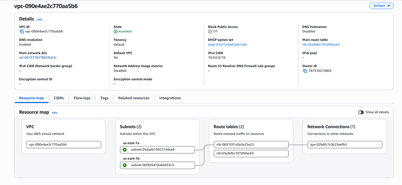
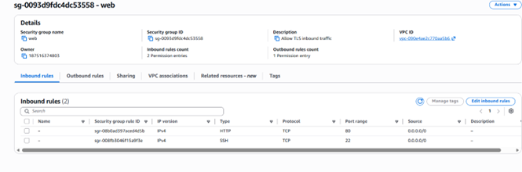
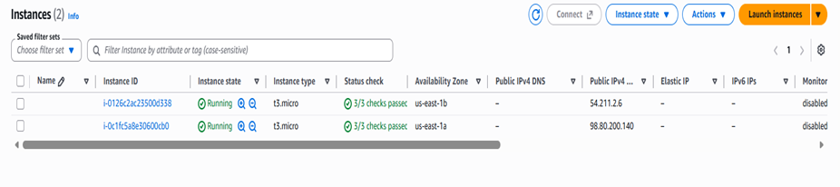
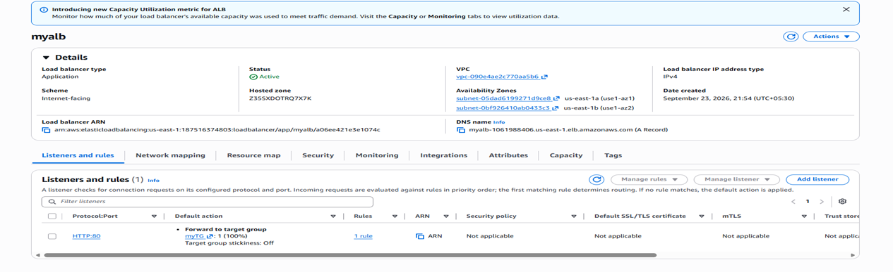
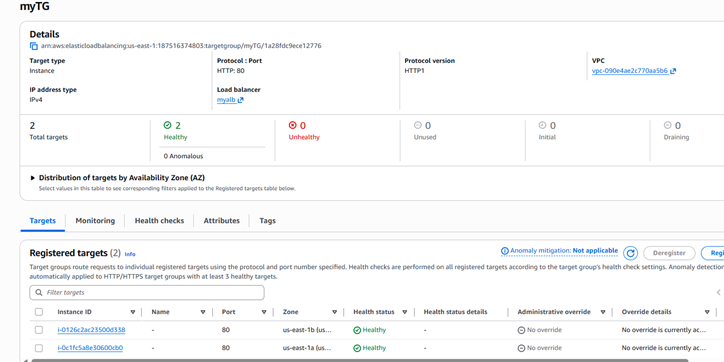
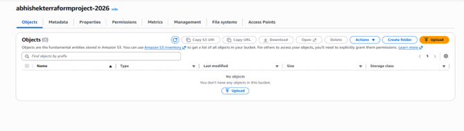
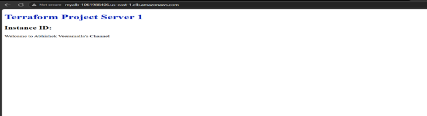
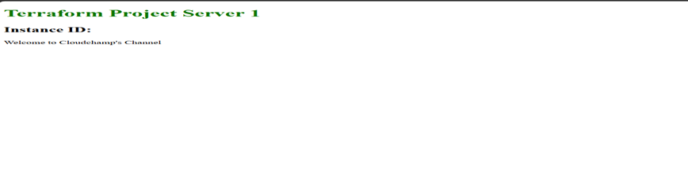

# Terraform AWS Web Infrastructure

This project demonstrates how to provision AWS infrastructure using Terraform.

## AWS Resources Used

- VPC
- 2 Public Subnets
- Internet Gateway
- Route Table
- Security Group
- 2 EC2 Instances
- Application Load Balancer
- Target Group
- ALB Listener
- S3 Bucket

## Architecture

Internet
   |
   v
Application Load Balancer
   |
   +-------------------+
   |                   |
   v                   v
EC2 Web Server 1    EC2 Web Server 2
Subnet 1            Subnet 2
   |                   |
   +--------- VPC -----+

## Terraform Concepts Used

- Infrastructure as Code (IaC)
- AWS Provider
- Terraform Resources
- Variables
- Resource Dependencies
- User Data
- Output Values

## Project Flow

1. Terraform creates a VPC.
2. Two public subnets are created in different Availability Zones.
3. An Internet Gateway is attached to the VPC.
4. A route table provides internet connectivity to the public subnets.
5. Two EC2 web servers are launched.
6. A Security Group allows HTTP and SSH traffic.
7. An Application Load Balancer is created.
8. EC2 instances are attached to the Target Group.
9. The ALB forwards HTTP requests to the EC2 instances.
10. Terraform outputs the ALB DNS name.

## Project Screenshots

### VPC


### Security Group


### EC2 Instances


### Application Load Balancer


### Target Group


### S3 Bucket


### Application Access




## Terraform Commands

```bash
terraform init
terraform validate
terraform plan
terraform apply
terraform destroy

Key Learning:

This project provided hands-on experience in provisioning and managing AWS infrastructure using Terraform instead of creating the infrastructure manually through the AWS Console.